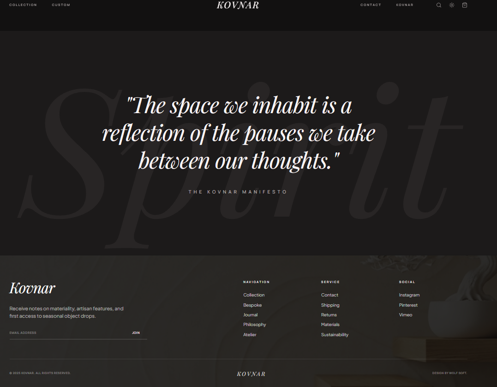
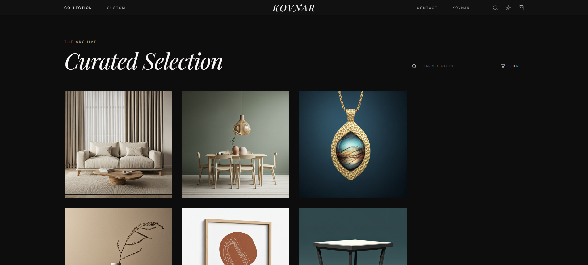
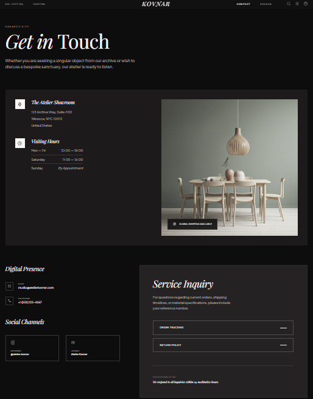

# Kovnar

> "The space we inhabit is a reflection of the pauses we take between our thoughts." — *The Kovnar Manifesto*

**Atelier Kovnar** is a premium, minimalist digital exhibition and catalog showcasing handcrafted architectural objects, vessels, lighting, and textiles. Designed with rich, luxurious aesthetics, smooth interactions, and a curated gallery layout, Kovnar provides a premium experience for design enthusiasts and curators.

---

## 📸 Project Preview

<figure>
  
  <figcaption>Figure 1: Landing Page Preview of Kovnar exhibition.</figcaption>
</figure>

## ✦ Key Features

- **Curated Digital Exhibition**: A beautiful, fluid grid displaying handcrafted art pieces categorised into Vessels, Lighting, Textiles, and Objects.
- **Bespoke Commissions Interface**: A fully interactive commission tool that allows clients to specify materials, finishes, dimensions, and upload reference files under custom budgets.
- **Master Studio Portal**: Live inline catalog curation. Access the admin view via the **Unlock Studio** link to edit, archive, or list new artisanal creations dynamically (Passcode: `kovnar`).
- **Seamless Cart & Checkout**: A premium flyout cart drawer and structured checkout flow built for an immersive retail experience.
- **Rich Micro-animations**: Powered by Motion to bring the aesthetic elements to life with organic, smooth transitions.

---

## 🛠 Technology Stack

- **Framework**: [React 19](https://react.dev/) + [TypeScript](https://www.typescriptlang.org/)
- **Build Tool**: [Vite 6](https://vite.dev/) (Pre-configured for lightning-fast HMR)
- **Styling**: [Tailwind CSS v4](https://tailwindcss.com/) via `@tailwindcss/vite`
- **Animations**: [Motion](https://motion.dev/)
- **Icons**: [Lucide React](https://lucide.dev/)
- **Routing**: [React Router v7](https://reactrouter.com/)

---

## 🚀 Getting Started

### Prerequisites
Make sure you have [Node.js](https://nodejs.org/) installed on your machine.

### Installation

1. **Clone the repository and install dependencies**:
   ```bash
   npm install
   ```

2. **Configure environment variables (Optional)**:
   Create a `.env.local` file based on `.env.example`:
   ```bash
   cp .env.example .env.local
   ```

3. **Start the local development server**:
   ```bash
   npm run dev
   ```
   The application will be running at [http://localhost:3000/](http://localhost:3000/).

---

## 📐 Available Scripts

- `npm run dev`: Starts the local development server on port 3000.
- `npm run build`: Generates the optimized production build of the website in the `dist/` directory.
- `npm run preview`: Previews the production build locally.
- `npm run clean`: Cleans up local build outputs.
- `npm run lint`: Runs Typechecking over the TypeScript codebase.

---

## 🔒 Master Studio Portal Access

To test the curation features:
1. Scroll down to the website footer or menu and click **Unlock Studio**.
2. Enter the studio passcode: **`kovnar`**
3. Once authenticated, you will unlock immediate **curator actions**:
   - Inline creation of new objects
   - Curatorial narration & price updates
   - Gallery image url updates
   - Archiving/deleting objects directly from the collection grid

## 🖼️ Project Gallery

<figure>
  
  <figcaption>Figure 2: Bag Option preview</figcaption>
</figure>

<figure>
  
  <figcaption>Figure 3: Bottom view</figcaption>
</figure>

<figure>
  
  <figcaption>Figure 4: Collection view</figcaption>
</figure>

<figure>
  
  <figcaption>Figure 5: Contact section</figcaption>
</figure>

<figure>
  
  <figcaption>Figure 6: Delivery progress</figcaption>
</figure>
